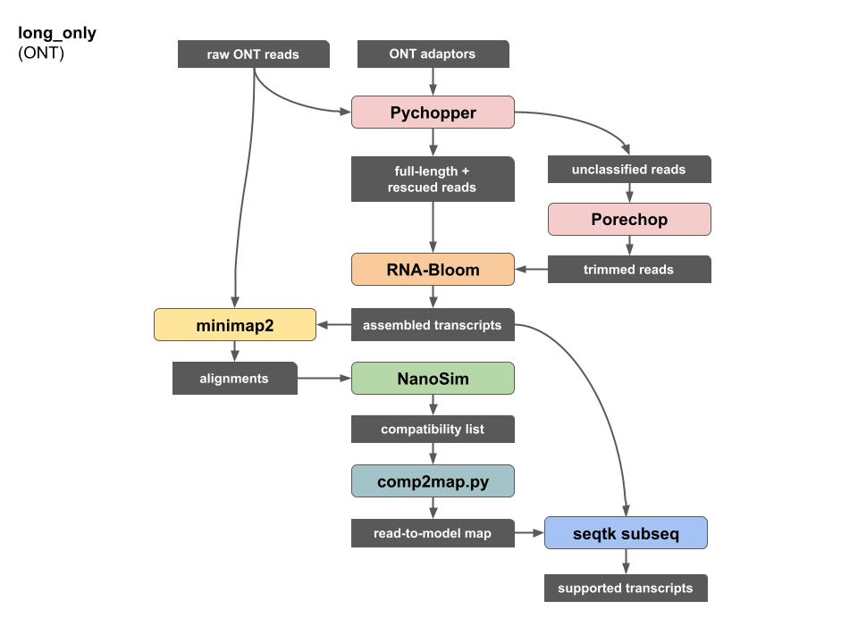

### Workflow dependencies

| name | version | link |
| --- | --- | --- |
| Pychopper | 2.5.0 | https://github.com/nanoporetech/pychopper |
| Porechop | 0.2.4 | https://github.com/rrwick/Porechop |
| RNA-Bloom | 1.4.3 | https://github.com/bcgsc/RNA-Bloom |
| minimap2 | 2.17-r941 | https://github.com/lh3/minimap2 |
| NanoSim | 3.0.2 | https://github.com/bcgsc/NanoSim |
| comp2map.py | N/A | https://github.com/bcgsc/lrgasp_birol/blob/main/scripts/ |
| seqtk | 1.3-r106 | https://github.com/lh3/seqtk |

### Workflow summary



### Software commands

#### 1. Pychopper

mouse ES sample (PCS110 primers):
```
python cdna_classifier.py -m edlib -b PCS110_primers.fas -Y 20000 -S stats.tsv -r report.pdf -u unclassified.fastq -w rescued.fastq -K qcfail.fastq input_reads.fq fulllength.fastq
```
manatee blood sample (default PCS109 primers):
```
python cdna_classifier.py -Y 20000 -S stats.tsv -r report.pdf -u unclassified.fastq -w rescued.fastq -K qcfail.fastq input_reads.fq fulllength.fastq
```

#### 2. Porechop
```
python porechop-runner.py -i unclassified.fastq -o unclassified.porechop.fastq --check_reads 100000 --end_threshold 70
```

#### 3. RNA-Bloom
```
java -jar RNA-Bloom.jar -t 48 -ntcard -artifact -long fulllength.fastq rescued.fastq unclassified.porechop.fastq -fpr 0.005 -indel 20 -p 0.75 -Q 15
```

#### 4. minimap2
```
cat fulllength.fastq rescued.fastq unclassified.porechop.fastq > all_trimmed_reads.fastq
minimap2 -x map-ont -c rnabloom.transcripts.fa all_trimmed_reads.fastq -t 12 -N 100 | gzip -c > alignments.paf.gz
```

#### 5. NanoSim
```
python nanopore_transcript_abundance.py -i alignments.paf.gz -c compatibility.tsv
```

#### 6. comp2map.py
```
python comp2map.py compatibility.tsv > read_to_model_map.tsv
```

#### 7. seqtk subseq
```
cut -f 2 read_to_model_map.tsv | tail -n +2 | sort | uniq > supported_transcript_ids.txt
seqtk subseq rnabloom.transcripts.fa supported_transcript_ids.txt > supported_transcripts.fa
```
