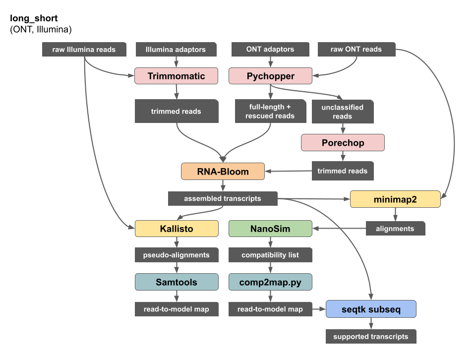

### Workflow dependencies

| name | version | link |
| --- | --- | --- |
| Trimmomatic | 0.39 | http://www.usadellab.org/cms/?page=trimmomatic |
| Pychopper | 2.5.0 | https://github.com/nanoporetech/pychopper |
| Porechop | 0.2.4 | https://github.com/rrwick/Porechop |
| RNA-Bloom | 1.4.3 | https://github.com/bcgsc/RNA-Bloom |
| kallisto | 0.46.2 | https://github.com/pachterlab/kallisto |
| samtools | 2.20-r1061 | https://github.com/samtools/samtools |
| NanoSim | 3.0.2 | https://github.com/bcgsc/NanoSim |
| seqtk | 1.3-r106 | https://github.com/lh3/seqtk |

### Workflow summary



### Software commands

#### 1. Pychopper
Classify ONT reads and trim adaptors.
* mouse ES sample (PCS110 primers):
```
python cdna_classifier.py -m edlib -b PCS110_primers.fas -Y 20000 -S stats.tsv -r report.pdf -u unclassified.fastq -w rescued.fastq -K qcfail.fastq raw_ONT_reads.fastq fulllength.fastq
```
* manatee blood sample (default PCS109 primers):
```
python cdna_classifier.py -Y 20000 -S stats.tsv -r report.pdf -u unclassified.fastq -w rescued.fastq -K qcfail.fastq input_reads.fq fulllength.fastq
```

#### 2. Porechop
Trim adaptors from unclassified ONT reads.
```
python porechop-runner.py -i unclassified.fastq -o unclassified.porechop.fastq --check_reads 100000 --end_threshold 70
```

#### 3. Trimmomatic
Trim adaptors from Illumina reads.
| species | adaptor file |
| --- | --- |
| mouse | [illumina_adaptors_mouse.fa](https://github.com/bcgsc/lrgasp_birol/blob/main/resources/illumina_adaptors_mouse.fa) |
| manatee | [illumina_adaptors_manatee.fa](https://github.com/bcgsc/lrgasp_birol/blob/main/resources/illumina_adaptors_manatee.fa) |
```
java -jar trimmomatic-0.39.jar PE -phred33 raw_illumina_1.fastq raw_illumina_2.fastq paired_1.fastq unpaired_1.fastq paired_2.fastq unpaired_2.fastq ILLUMINACLIP:adaptors.fa:2:30:10 LEADING:3 TRAILING:3 SLIDINGWINDOW:4:15 MINLEN:25
```

#### 4. RNA-Bloom
Assemble transcripts from trimmed ONT reads with polishing using trimmed Illumina reads.
```
java -jar RNA-Bloom.jar -t 48 -ntcard -artifact -long fulllength.fastq rescued.fastq unclassified.porechop.fastq -left paired_1.fastq -right paired_2.fastq -rcr -sef unpaired_1.fastq -ser unpaired_2.fastq -fpr 0.005 -indel 20 -p 0.75 -Q 15
```

#### 5. minimap2
Align raw ONT reads against assembled transcripts.
```
minimap2 -x map-ont -c rnabloom.transcripts.fa raw_reads.fastq -t 12 -N 100 | gzip -c > alignments.paf.gz
```

#### 6. NanoSim
Generate read compatibility list for ONT reads.
```
python nanopore_transcript_abundance.py -i alignments.paf.gz -c compatibility.tsv
```

#### 7. comp2map.py
Convert ONT read compatibility list to read-to-model map.
```
python comp2map.py compatibility.tsv > read_to_model_map.tsv
```

#### 8. Kallisto
Generate pseudo-alignments of raw Illumina reads against assembled transcripts.
```
kallisto index -i index rnabloom.transcripts.nr.fa
kallisto quant -t 24 --fr-stranded -i index -o . --pseudobam raw_1.fastq raw_2.fastq
```

#### 9. Samtools
Extract Illumina read-to-model map from pseudo-alignments and append to existing map.
```
samtools view -f 0x2 -F 0x4 pseudoalignments.bam | cut -f 1,3 | uniq >> illumina_read_to_model_map.tsv
```

#### 10. seqtk subseq
Extract transcripts supported by reads.
```
cut -f 2 read_to_model_map.tsv | tail -n +2 | sort | uniq > supported_transcript_ids.txt
seqtk subseq rnabloom.transcripts.fa supported_transcript_ids.txt > supported_transcripts.fa
```
