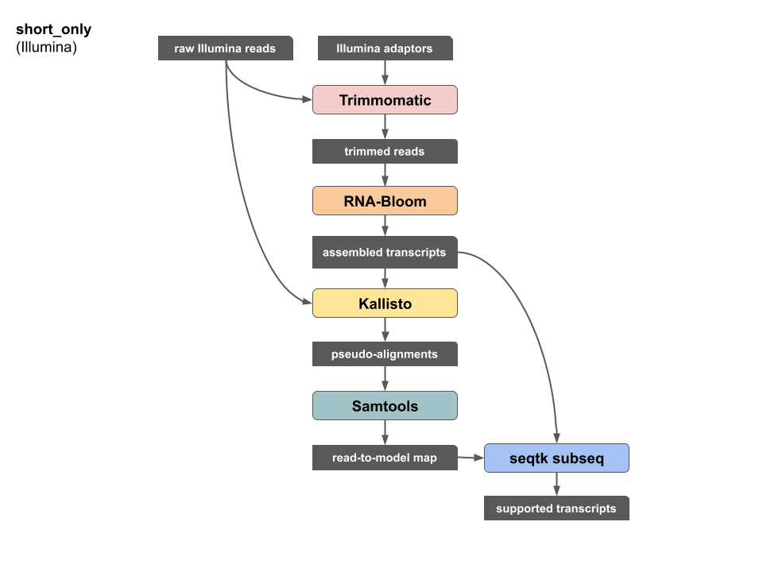

### Workflow dependencies

| name | version | link |
| --- | --- | --- |
| Trimmomatic | 0.39 | http://www.usadellab.org/cms/?page=trimmomatic |
| RNA-Bloom | 1.4.3 | https://github.com/bcgsc/RNA-Bloom |
| kallisto | 0.46.2 | https://github.com/pachterlab/kallisto |
| samtools | 2.20-r1061 | https://github.com/samtools/samtools |
| seqtk | 1.3-r106 | https://github.com/lh3/seqtk |

### Workflow summary



### Software commands

#### 1. Trimmomatic

```
java -jar trimmomatic-0.39.jar PE -phred33 raw_1.fastq raw_2.fastq paired_1.fastq unpaired_1.fastq paired_2.fastq unpaired_2.fastq ILLUMINACLIP:adaptors.fa:2:30:10 LEADING:3 TRAILING:3 SLIDINGWINDOW:4:15 MINLEN:25
```

#### 2. RNA-Bloom
```
java -jar RNA-Bloom.jar -t 48 -ntcard -stranded -left paired_1.fastq -right paired_2.fastq -rcr -sef unpaired_1.fastq -ser unpaired_2.fastq -fpr 0.005 -k 25 -indel 2 -q 15 -Q 15
```

#### 3. Kallisto
```
kallisto index -i index rnabloom.transcripts.nr.fa
kallisto quant -t 24 --fr-stranded -i index -o . --pseudobam raw_1.fastq raw_2.fastq
```

#### 4. Samtools
```
echo "read_id	transcript_id" > read_to_model_map.tsv
samtools view -f 0x2 -F 0x4 pseudoalignments.bam | cut -f 1,3 | uniq >> read_to_model_map.tsv
```

#### 5. seqtk subseq
```
cut -f 2 read_to_model_map.tsv | tail -n +2 | sort | uniq > supported_transcript_ids.txt
seqtk subseq rnabloom.transcripts.nr.fa supported_transcript_ids.txt > supported_transcripts.fa
```
